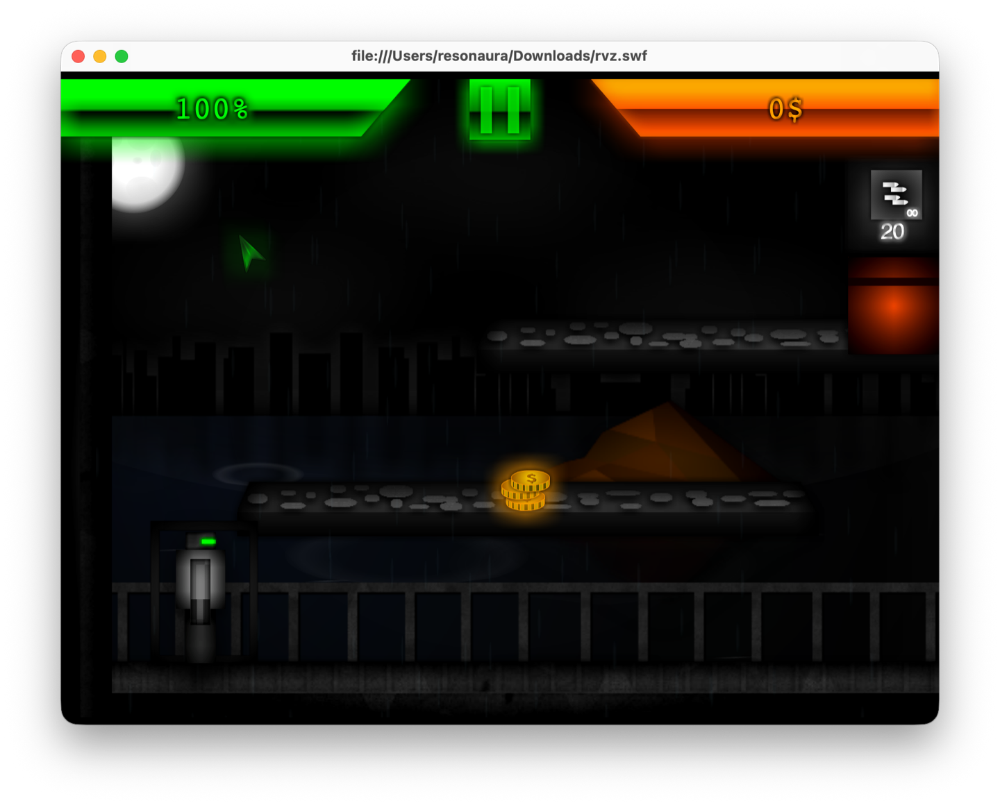
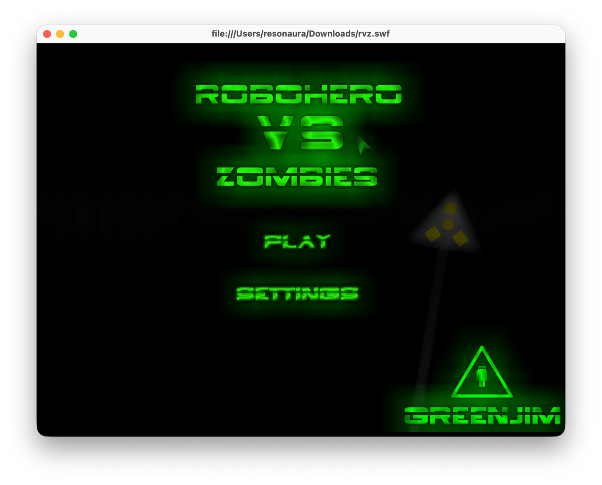
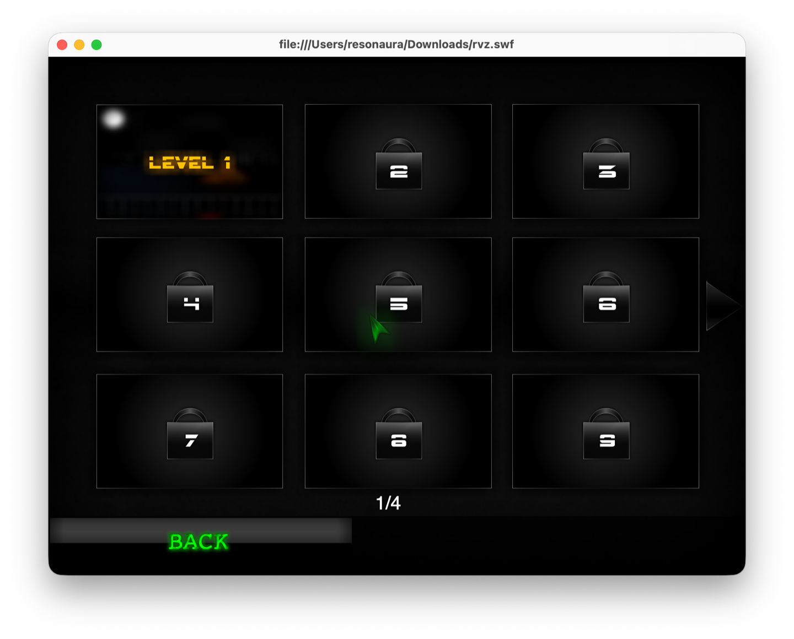

# Robohero vs Zombies

Retro 2D action platformer and shooter developed at age 14 under indie team **GREENJIM STUDIOS**.

[-blue.svg?style=flat-square)](#)

  

## The Story

I began writing code at age 12, experimenting with simple scripts and game mechanics. By age 14, together with childhood friends, we formed our first game development group: **GREENJIM STUDIOS**.

*Robohero vs Zombies* was our most ambitious project from that era:
- Multi-tier platforming with physics, jumping arcs, and gravity calculations.
- Weapon and ammunition management featuring primary infinite fire and limited heavy shells.
- Dynamic environmental effects including rain particle generators and night backdrops.
- Coin collection systems, health tracking, and multi-page level unlock progression.

  

---

## The Origin of Defensive Engineering

During the final stages of development, the working machine suffered storage corruption. Without version control in place, the original unversioned `.fla` source project was destroyed.

That experience taught an early, lasting lesson about software engineering:
1. Code without automated version control does not truly exist.
2. Backups must be redundant and distributed.
3. System architecture must always assume catastrophic failure modes.

That painful loss sparked an enduring interest in version control workflows, reliable infrastructure, and low-level systems programming that later defined my career.

While the editable source files were lost, compiled `.swf` binaries survived on separate storage media and are preserved here.

---

## Level Selection & Progression

  

---

## Playing the Game

### Play in Browser
Open **[resonaura.github.io/robohero-vs-zombies](https://resonaura.github.io/robohero-vs-zombies/)** to run the game through the [Ruffle](https://ruffle.rs/) WebAssembly Flash emulator. No browser plugins required.

### Local Playback
You can run `rvz.swf` in any standalone Flash player or local Ruffle desktop binary:
- `rvz.swf`: Final playable compiled build.
- `rvz-old.swf`: Earlier milestone snapshot recovered from storage.

---

## Controls

- **Move / Jump**: Arrow Keys or `W` `A` `D`
- **Aim / Shoot**: Mouse cursor + Left Click
- **Switch Weapons**: Number Keys
- **Pause**: `P` or onscreen button

---

## Credits

- **Programming & Design**: Andrii Vynohradov (GREENJIM STUDIOS)
